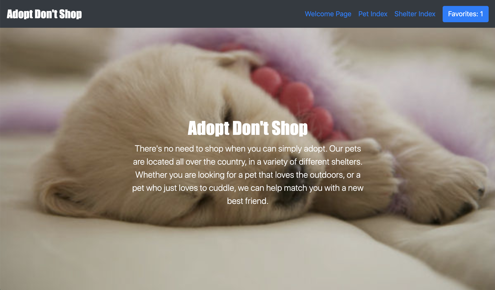
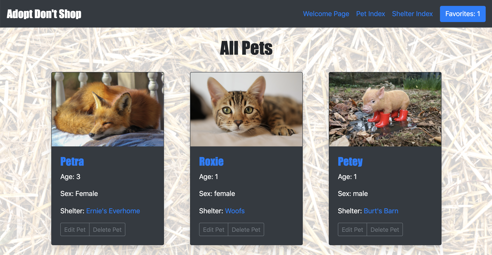
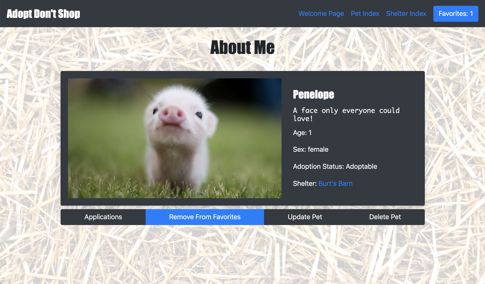
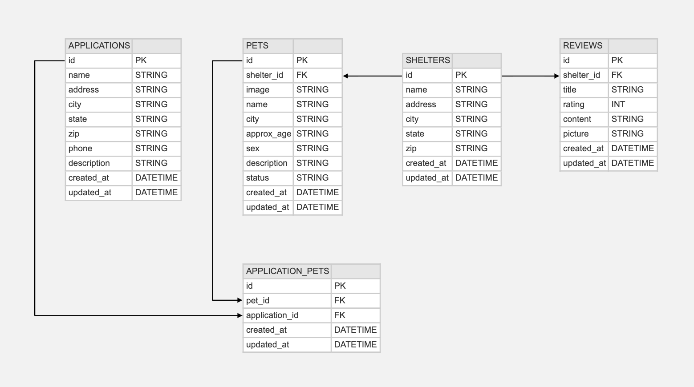

# __Adopt Don't Shop__
# _aka_ 'The McGrevey-Lynch Petopia'

  

## Description

**Adopt Don't Shop** is a fictional platform that allows a vistor to browse, favorite, then apply to adopt pets from various shelters. Reviews can also be created for feedback to the individual shelters. Built as a paired project while attending [Turing School of Software and Design](https://turing.io/), the app demonstrates Ruby on Rails **MVC** design patterns, **CRUD** functionality for pets, shelters, reviews, etc. and was developed using **TDD** (test driven design) practices.  
   
  

  
  
## Deployment Link
- https://mcgrevey-lynch-petopia.herokuapp.com/
  
## Local Setup Instructions
#### Ruby and Rails Setup

- Clone this repo to your local machine using SSH:
```
  git clone git@github.com:kmcgrevey/adopt_dont_shop_paired.git
```
- Install dependencies from the Gemfile:
```
bundle install
```

#### Database Setup  


  
- Create the database:
```
rake db:create
```
- Run ActiveRecord migrations to add the tables to database:
``` 
rake db:migrate
```
- Add some data (_and cute pets!_) to get you started:
```
rake db:seed
```

#### Starting Rails Server
- To run server on `localhost:3000/`:
```
rails s
```

## Testing and Coverage
- To run the entire testing suite:
```
bundle exec rspec
```
- To generate coverage report (viewable in your browser):
```
open coverage/index.html
```

## Contributors

- [Kevin McGrevey](https://github.com/kmcgrevey)  
- [Michael Alex Lynch](https://github.com/mlynch5187)
  
## Technologies and Frameworks

- Language: Ruby 2.6.3
- Framework: Rails 5.1.7
- Testing: RSpec, Capybara, SimpleCov
- Styling: CSS (external and in-line), Bootstrap
- Deployment: Heroku
- Project Management: Github Projects
- Communication: Slack, Tuple
  

  
  
